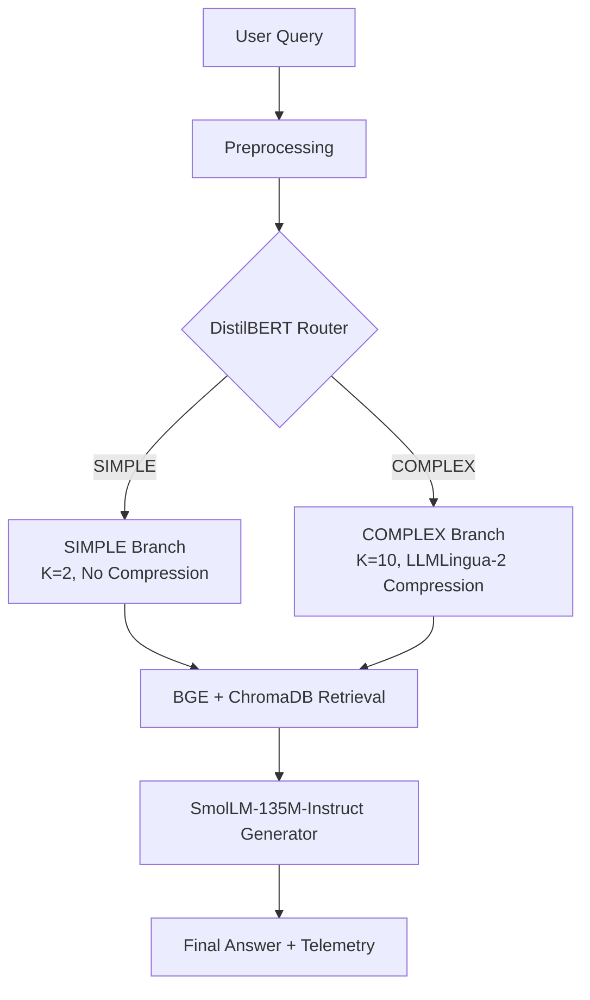

# AdaptiveRAG

> Query-complexity-aware retrieval and selective context compression for efficient Retrieval-Augmented Generation.

AdaptiveRAG is a system-level empirical investigation into optimizing Retrieval-Augmented Generation (RAG) by dynamically varying retrieval depth and selectively activating context compression based on query complexity.

**[Project Overview](#project-overview) • [Architecture](#architecture) • [Key Results](#key-results) • [Running the Project](#running-the-project) • [Research Paper](#research-paper)**

---

## Project Overview
Conventional RAG pipelines typically apply a fixed retrieval depth to every query. This uniform approach can retrieve excessive context for simple factual questions, inflating latency and cost, or retrieve insufficient evidence for complex multi-hop queries, harming reasoning performance.

AdaptiveRAG investigates whether query complexity can govern the execution path. The proposed policy routes queries into two branches:
- **SIMPLE Branch:** Retrieves $K = 2$ chunks; bypasses compression.
- **COMPLEX Branch:** Retrieves $K = 10$ chunks; applies chunk-wise compression via LLMLingua-2.

*Note:* This repository is an empirical, system-level investigation. It does not claim individual architectural novelty for DistilBERT, BGE, ChromaDB, or LLMLingua-2.

---

## Research Question
> *Can a lightweight pre-retrieval complexity classifier efficiently optimize the RAG pipeline by adaptively varying retrieval depth and selectively triggering context compression, and under what conditions does this yield a net latency improvement?*

---

## Architecture

*Data Flow:* Incoming queries are cleaned and routed by a fine-tuned DistilBERT classifier. SIMPLE queries execute a shallow, fast retrieval path. COMPLEX queries execute a deep retrieval path followed by conditional token compression. The resulting context is assembled into a prompt and fed to the generator.

---

## Technology Stack
| Component | Implementation |
| :--- | :--- |
| **Language** | Python |
| **Primary Router** | `distilbert-base-uncased` (fine-tuned) |
| **Alternative Router** | `bert-base-uncased` (fine-tuned, for comparison) |
| **Embeddings** | `BAAI/bge-small-en-v1.5` |
| **Vector Database** | ChromaDB |
| **Context Compressor**| `LLMLingua-2` (`microsoft/llmlingua-2-bert-base-multilingual-cased-meetingbank`) |
| **Generator** | `HuggingFaceTB/SmolLM-135M-Instruct` |
| **Execution** | CPU-only local execution |

---

## Datasets
The project uses subsets of PopQA (simple proxy) and HotpotQA (complex proxy) to establish complexity labels.

| Dataset / Artifact | Purpose | Samples |
| :--- | :--- | :--- |
| **Training Set** | Fine-tuning the router | 160 |
| **Development Set** | Validation during training | 40 |
| **Router Evaluation Artifact** | Standalone robust evaluation of the classifier | 298 |
| **End-to-End Benchmark** | Primary system downstream evaluation | 10 (5 PopQA + 5 HotpotQA) |

*Important:* The 298-sample router evaluation artifact is distinct from the 10-query end-to-end benchmark.

---

## Experiments

### Baselines
The system is evaluated across four controlled strategies:

| Strategy | Retrieval | K | Compression | Router |
| :--- | :--- | :--- | :--- | :--- |
| **LLM-only** | None | 0 | None | None |
| **Fixed RAG** | Standard | 5 | None | None |
| **Always-Compress** | Standard | 10 | LLMLingua-2 | None |
| **AdaptiveRAG** | Adaptive | 2/10 | Conditional | DistilBERT |

### Classifier Comparison
The optimal router was selected by comparing `distilbert-base-uncased` against `bert-base-uncased` on the 298-sample robust evaluation artifact.

### Compression Ablation
An ablation study evaluates the exact cost and token savings of applying LLMLingua-2 on a static $K=10$ retrieval path against a non-compressed $K=10$ baseline.

---

## Key Results

### Router Comparison
| Metric | DistilBERT | BERT |
| :--- | :--- | :--- |
| **Accuracy** | 99.33% | 97.32% |
| **Precision** | 99.35% | 100.00% |
| **Recall** | 99.35% | 94.84% |
| **F1** | 99.35% | 97.35% |
| **Latency** | 12.42 ms | 22.30 ms |

*DistilBERT was better suited to this experimental setup based on higher recall, F1, accuracy, and lower routing latency.*

### Primary Benchmark
| Strategy | Latency |
| :--- | :--- |
| **LLM-only** | 11.877 s |
| **Fixed RAG** | 18.472 s |
| **Always-Compress** | 19.510 s |
| **AdaptiveRAG** | **16.514 s** |

### Compression Ablation
Observed under strictly CPU-based execution:
- **Token Reduction:** 51.46%
- **Compression Overhead:** 13.488 s
- **Generation Savings:** 21.419 s
- **Net Total-Latency Reduction:** 8.806 s

### ⚠️ Answer Quality Caveat
**Exact Match (EM) = 0.0 across the primary benchmark.**
SmolLM-135M was selected for CPU feasibility, but its severely limited reasoning capacity proved to be a major answer-quality bottleneck. The system's downstream impact on factual correctness cannot be reliably established without a stronger generator.

---

## Classifier Downstream Effect
While the 298-sample evaluation exposed meaningful differences between DistilBERT and BERT, both routers made identical routing decisions on the 10-query end-to-end benchmark. Consequently, the downstream retrieval and compression paths were identical. This demonstrates that the 10-query set is too small to expose classifier edge cases.

---

## Results at a Glance

| [Classifier Performance](paper/figures/classifier_performance.png) | [Classifier Latency](paper/figures/classifier_latency.png) |
| :---: | :---: |
| | |
| **[Benchmark Latency](paper/figures/benchmark_latency.png)** | **[Token Reduction](paper/figures/token_reduction.png)** |

---

## Reproducibility
Key evaluation outputs and numerical logs are preserved in this repository:
- `results/primary_benchmark/`
- `results/m12/` (Ablation study)
- `results/router_comparison/`
- `results/literature_comparison.csv`

*Note:* Full one-command reproducibility requires local generation of HuggingFace weights and a populated ChromaDB vector index, which are intentionally excluded from version control.

---

## Running the Project

Ensure you have a populated ChromaDB index and the necessary dependencies installed.

```bash
# Evaluate the standalone trained router
python scripts/evaluate_router.py

# Compare DistilBERT and BERT classifiers
python scripts/compare_routers.py

# Execute the compression ablation study
python scripts/run_m12_ablation.py

# Run the primary end-to-end benchmark
python scripts/run_primary_benchmark.py
```

---

## Repository Structure
```text
AdaptiveRAG/
├── configs/            # YAML configurations
├── datasets/           # Data loaders, indexing logic, PopQA/HotpotQA datasets
├── docs/               # System architecture and design documentation
├── paper/              # Final IEEE conference paper (LaTeX source and figures)
├── results/            # Benchmark outputs, comparisons, and ablation artifacts
├── scripts/            # Executable workflows (training, evaluation, benchmarking)
├── src/                # Core pipeline logic and model wrappers
├── tests/              # Pytest suite
├── pyproject.toml
├── requirements.txt
└── README.md
```

---

## Testing
The current test suite passes **123 tests** covering the core pipeline, routing, retrieval, evaluation, and research-critical behavior.

```bash
python -m pytest tests/
```

---

## Limitations
- **10-query end-to-end benchmark:** Insufficient scale for statistical significance.
- **Proxy complexity labels:** Training targets derived from dataset membership may teach shortcut heuristics rather than genuine semantic complexity.
- **Weak SmolLM-135M generator:** Prevents meaningful answer-quality evaluation.
- **CPU-only latency measurements:** Heavily inflates generation times, presenting a favorable compression economy that may vanish on GPU architectures.
- **LLMLingua-2 512-token constraint:** Requires chunk-wise compression, causing overhead to scale linearly with $K$.
- **Limited generalizability:** Findings are restricted to this specific data/hardware intersection.

---

## Research Paper
The full findings are formalized in an IEEE conference-style paper located at:
- **Source:** [`paper/main.tex`](paper/main.tex)
- **Bibliography:** [`paper/references.bib`](paper/references.bib)

*(When compiled, the final PDF will be located at `paper/AdaptiveRAG_IEEE_Paper.pdf`)*

---

## Research Artifacts
| Category | Location |
| :--- | :--- |
| **Primary Benchmark** | [`results/primary_benchmark/`](results/primary_benchmark/) |
| **Compression Ablation** | [`results/m12/`](results/m12/) |
| **Router Comparison** | [`results/router_comparison/`](results/router_comparison/) |
| **Literature Comparison** | [`results/literature_comparison.csv`](results/literature_comparison.csv) |
| **IEEE Paper Source** | [`paper/`](paper/) |
