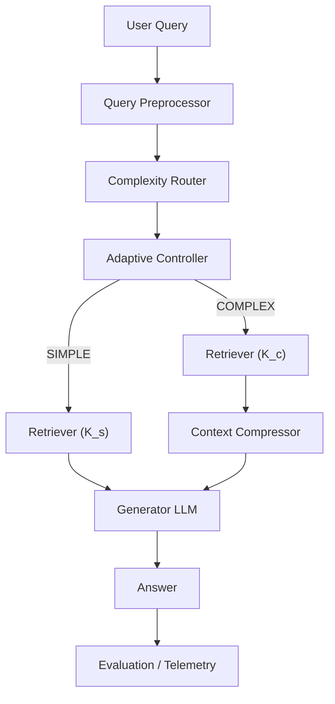
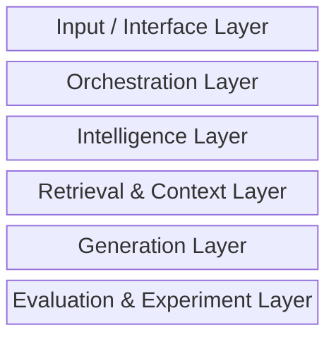
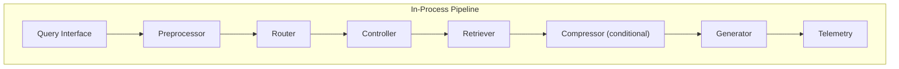
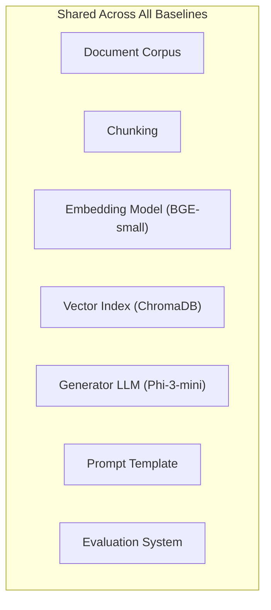
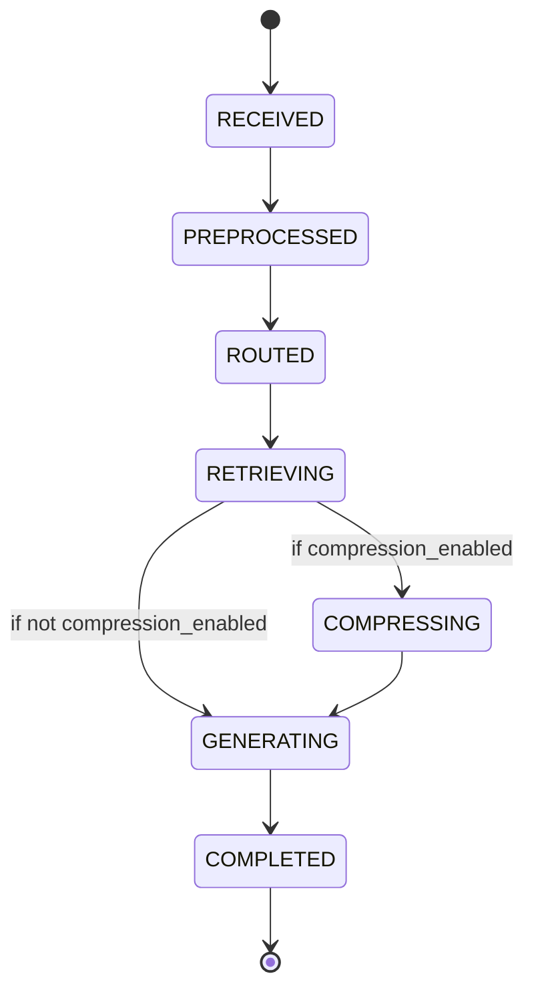
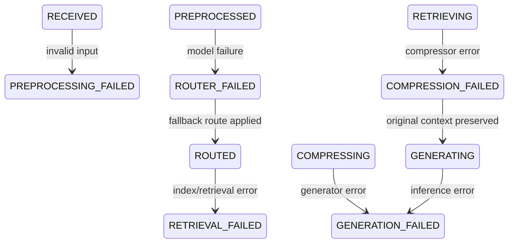

# AdaptiveRAG — Technical Architecture

> **Status:** Architecture v1.0  
> **Derived From:** [`prod-spec.md`](file:///c:/Users/aniru/AdaptiveRAG/docs/prod-spec.md)  
> **Project:** AdaptiveRAG — Adaptive Retrieval-Augmented Generation using Query Complexity and Context Optimization  
> **Purpose:** Define HOW the system is technically organized so that the product specification can be implemented correctly

---

## 1. Purpose and Scope

This document is the architectural companion to `prod-spec.md`.

```text
prod-spec.md          →  WHAT and WHY
architecture.md       →  HOW the system is structured
src/                  →  actual implementation
```

**This document defines:**

- system decomposition into subsystems and layers;
- responsibilities, inputs, outputs, and boundaries of every major component;
- end-to-end data flow for every execution path;
- how the four research baselines share infrastructure;
- interface contracts between components;
- failure handling architecture;
- configuration, state, storage, and observability architecture;
- repository module boundaries;
- hardware/software boundary;
- testing architecture;
- open architectural decisions requiring human confirmation.

**This document does NOT:**

- repeat the full product specification;
- contain implementation code;
- change any product requirement;
- claim any unmeasured performance result.

---

## 2. Architectural Overview

### 2.1 High-Level System Diagram



### 2.2 Core Behavioral Flow

The canonical execution path, as defined by the product specification:

```text
                    QUERY
                      |
                      v
               PREPROCESSOR
                      |
                      v
              COMPLEXITY ROUTER
                      |
                      v
             ADAPTIVE CONTROLLER
                 /          \
                /            \
           SIMPLE           COMPLEX
              |                 |
              v                 v
         RETRIEVE K_s      RETRIEVE K_c
              |                 |
              |                 v
              |           CONTEXT COMPRESSOR
              |                 |
              +--------+--------+
                       |
                       v
                 GENERATOR LLM
                       |
                       v
                    ANSWER
                       |
                       v
              EVALUATION / LOGGING
```

This flow is architecturally invariant. All implementation must preserve it.

---

## 3. Architectural Layers

The system is organized into six logical layers. Each layer has a clear responsibility boundary.



### 3.1 Input / Interface Layer

**Responsibility:** Accept a natural-language query and return an answer with execution metadata.

- Not the research contribution.
- Initial implementation: CLI or script invocation.
- May later include: simple API, lightweight UI.
- Must NOT require a sophisticated frontend.

### 3.2 Orchestration Layer

**Responsibility:** Coordinate the pipeline from preprocessing through generation to telemetry.

- Contains the pipeline orchestrator and the adaptive routing controller.
- Must remain deterministic and modular.
- Must NOT become an autonomous agent.

### 3.3 Intelligence Layer

**Responsibility:** Estimate query complexity.

- Contains the complexity router (classifier).
- The router is the only learned decision-making component in the core pipeline.
- Must be independently testable and benchmarkable.

### 3.4 Retrieval & Context Layer

**Responsibility:** Embed queries, store/retrieve document chunks, and optionally compress retrieved context.

- Contains: embedding model, vector store/index, retriever, context compressor.
- All primary baselines share the same retrieval infrastructure (corpus, chunking, embeddings, index).
- Compression is invoked conditionally — the compressor itself does not decide when to run.

### 3.5 Generation Layer

**Responsibility:** Generate answers from query + context.

- Contains the fixed generator LLM interface.
- The generator is frozen across all primary baselines.
- Must NOT perform routing or compression decisions.

### 3.6 Evaluation & Experiment Layer

**Responsibility:** Execute benchmarks, compute metrics, record experiment metadata, persist results.

- Contains: evaluator, metrics computation, experiment logger, result writer.
- Must NOT alter research logic or pipeline behavior.
- Must produce machine-readable, traceable artifacts.

---

## 4. System Components

### 4.1 Query Interface

| Property | Value |
|---|---|
| **Responsibility** | Accept query, invoke pipeline, return answer + metadata |
| **Input** | Natural-language query string |
| **Output** | Answer string + `ExecutionMetadata` |
| **Boundary** | Does not perform routing, retrieval, or generation |

The interface is initially a CLI or script entry point. A lightweight demo UI is optional and post-MVP.

---

### 4.2 Query Preprocessor

| Property | Value |
|---|---|
| **Responsibility** | Validate and normalize the input query |
| **Input** | Raw query string |
| **Output** | `PreprocessedQuery` (normalized query + original query) |
| **Deterministic** | Yes |

**Must:**
- Validate input (reject empty/malformed queries).
- Normalize whitespace and trivial formatting.
- Preserve the original query for logging/evaluation.

**Must NOT:**
- Generate answers.
- Retrieve documents.
- Make routing decisions.
- Rewrite the query using an LLM.

---

### 4.3 Complexity Router

| Property | Value |
|---|---|
| **Responsibility** | Classify query complexity as SIMPLE or COMPLEX |
| **Input** | Normalized query string |
| **Output** | `ComplexityResult { label: SIMPLE\|COMPLEX, confidence?: float }` |
| **Preferred model direction** | DeBERTa-v3-small (replaceable) |
| **Deterministic** | Model inference is deterministic given the same input and seed |

**Architectural requirements:**
- Must be independently testable and benchmarkable.
- Must expose latency measurement.
- Must remain modular — the model can be replaced without redesigning the pipeline.
- Must NOT use the generator LLM for routing decisions.
- Binary classification only for the MVP.

**Model inference boundary:** This is a model-inference call. It crosses from in-process Python into neural-network forward pass. Latency must be measured separately.

---

### 4.4 Adaptive Routing Controller

| Property | Value |
|---|---|
| **Responsibility** | Convert `ComplexityResult` into a concrete execution plan |
| **Input** | `ComplexityResult` |
| **Output** | `RoutingDecision { complexity, retrieval_k, compression_enabled }` |
| **Deterministic** | Yes — pure policy mapping |

**Routing policy (from product specification):**

| Complexity | retrieval_k | compression_enabled |
|---|---|---|
| SIMPLE | `K_simple` (default: 2) | `false` |
| COMPLEX | `K_complex` (default: 10) | `true` |

All values are configuration-driven, not hard-coded constants.

The controller must NOT be an LLM-based agent.

---

### 4.5 Embedding Model

| Property | Value |
|---|---|
| **Responsibility** | Convert text (queries and document chunks) into dense vectors |
| **Preferred model direction** | BAAI/bge-small-en-v1.5 |
| **Used by** | Index construction (offline), query embedding (online retrieval) |

The same embedding model must be used for both indexing and query-time retrieval.

The same embedding model must be used across all primary baselines.

**Model inference boundary:** Embedding inference. Latency contributes to retrieval latency.

---

### 4.6 Vector Store / Index

| Property | Value |
|---|---|
| **Responsibility** | Store chunk embeddings; retrieve top-K candidates by similarity |
| **Preferred direction** | ChromaDB |
| **Alternative** | FAISS (requires decision log entry if changed) |
| **Persistent** | Yes — the index is built once and reused across all baselines |

**Fairness constraint:** All primary baselines use the identical index.

---

### 4.7 Retriever

| Property | Value |
|---|---|
| **Responsibility** | Perform dense semantic retrieval |
| **Input** | `query: string, top_k: int` |
| **Output** | `RankedDocuments [ { document_id, chunk_id, text, score, rank, metadata } ]` |
| **Deterministic** | Given the same index and query, results are deterministic |

**Boundary:** The retriever does NOT decide whether to compress. That decision belongs to the routing controller.

**Fairness constraint:** The retrieval implementation is shared across all primary baselines. Only `top_k` changes.

**Model inference boundary:** Query embedding is a sub-step of retrieval.

---

### 4.8 Context Compressor

| Property | Value |
|---|---|
| **Responsibility** | Reduce context token volume when compression is enabled |
| **Input** | `query: string, retrieved_context: string` |
| **Output** | `OptimizedContext { text, original_tokens, compressed_tokens, ratio, latency_ms, status }` |
| **Preferred direction** | LLMLingua (or compatible implementation) |
| **Invocation** | Conditional — only when `RoutingDecision.compression_enabled == true` |

**Critical architectural boundary:**

The compressor is not the research contribution. The contribution is *when* compression is invoked (complexity-gated selective compression). The compressor itself is an established external tool.

```text
SIMPLE route  →  compressor NOT invoked
COMPLEX route →  compressor invoked
```

**Model inference boundary:** Compression involves model inference (LLMLingua uses a small language model). Compression latency must be measured independently.

**Failure behavior:** If compression fails, preserve the original retrieved context where safe, log the failure, and continue.

---

### 4.9 Generator LLM

| Property | Value |
|---|---|
| **Responsibility** | Generate an answer from query + context |
| **Input** | `query: string, context: string` |
| **Output** | `GeneratedAnswer { text, generation_latency_ms }` |
| **Preferred model direction** | Phi-3-mini-class instruct model (or Llama 3-class alternative) |
| **Frozen** | Yes — not fine-tuned; same model across all primary baselines |

**Prompt contract:**

```text
Question:
    <user query>

Context:
    <retrieved or compressed context>
```

The prompt structure must remain identical across all primary baselines.

**Configuration-driven parameters:**

- `temperature`
- `max_new_tokens`
- `seed` (where supported)

**Model inference boundary:** The heaviest inference step. Dominates total latency in most configurations.

---

### 4.10 Evaluation System

| Property | Value |
|---|---|
| **Responsibility** | Execute benchmarks, compute metrics, compare baselines |
| **Input** | `Predictions + References + RetrievalMetadata` |
| **Output** | `EvaluationMetrics` |

**Answer quality metrics (primary):**

| Metric | Description |
|---|---|
| Exact Match (EM) | Binary match against reference answer |
| Token-level F1 | Token overlap between generated and reference answers |

**Retrieval quality metrics (where ground-truth evidence permits):**

| Metric | Description |
|---|---|
| Recall@K | Fraction of relevant documents retrieved |
| MRR | Mean Reciprocal Rank |
| nDCG | Normalized Discounted Cumulative Gain (where appropriate) |

**Router quality metrics:**

| Metric | Description |
|---|---|
| Accuracy | Overall classification accuracy |
| Precision | Per-class precision |
| Recall | Per-class recall |
| F1 | Per-class and macro F1 |
| Confusion Matrix | Full SIMPLE/COMPLEX confusion matrix |

**Efficiency metrics:**

| Metric | Description |
|---|---|
| Router latency (ms) | Time for complexity classification |
| Retrieval latency (ms) | Time for embedding + vector search |
| Compression latency (ms) | Time for context compression |
| Generation latency (ms) | Time for LLM inference |
| Total latency (ms) | Sum of all stages + overhead |
| Retrieved context tokens | Token count before compression |
| Compressed context tokens | Token count after compression |
| Final prompt tokens | Tokens sent to generator |
| Compression ratio | `original_tokens / compressed_tokens` |

---

### 4.11 Experiment / Telemetry Layer

| Property | Value |
|---|---|
| **Responsibility** | Record experiment configuration, execution metadata, and results |
| **Must NOT** | Alter pipeline behavior or research logic |

**Per-query metadata captured:**

```text
query_id
query
complexity
router_confidence
retrieval_k
compression_applied
original_context_tokens
compressed_context_tokens
compression_ratio
router_latency_ms
retrieval_latency_ms
compression_latency_ms
generation_latency_ms
total_latency_ms
error/fallback_status
```

**Per-experiment metadata captured:**

```text
experiment_id
timestamp
git_commit
config
hardware
model_identifiers
dataset
split
sample_count
results
```

---

## 5. Communication Paths

### 5.1 In-Process Communication

All component-to-component communication within the pipeline is in-process Python (function/method calls with typed objects). No network protocols, message queues, or microservices.



### 5.2 Model Inference Boundaries

These are the points where the pipeline crosses from pure Python logic into neural-network inference:

| Boundary | Component | Model |
|---|---|---|
| Routing inference | Complexity Router | DeBERTa-v3-small (or replacement) |
| Embedding inference | Embedding Model (via Retriever) | BGE-small-en-v1.5 (or replacement) |
| Compression inference | Context Compressor | LLMLingua internal model |
| Generation inference | Generator LLM | Phi-3-mini (or replacement) |

Each boundary must have its latency measured independently.

### 5.3 Persistent Storage Boundaries

| Storage | Read/Write | Contents |
|---|---|---|
| Configuration files | Read | YAML/JSON experiment configuration |
| Source corpus | Read | Raw documents / dataset downloads |
| Chunk store | Read/Write | Chunked documents (built once) |
| Vector index | Read/Write | Embeddings index (built once, read at query time) |
| Results directory | Write | Experiment metrics, predictions, latency, logs |
| Router training data | Read/Write | Training/validation splits for classifier |

---

## 6. End-to-End Data Flow

### 6.1 Normal Query — SIMPLE Path

```text
User provides query string
    │
    ▼
Preprocessor
    │  validates input, normalizes whitespace
    │  output: PreprocessedQuery { original, normalized }
    ▼
Complexity Router
    │  runs model inference on normalized query
    │  output: ComplexityResult { label: SIMPLE, confidence: 0.87 }
    ▼
Adaptive Controller
    │  applies routing policy: SIMPLE → K=2, compression=false
    │  output: RoutingDecision { complexity: SIMPLE, retrieval_k: 2, compression_enabled: false }
    ▼
Retriever
    │  embeds query, searches vector index for top-2 chunks
    │  output: RankedDocuments [ chunk_1, chunk_2 ]
    ▼
Compression: SKIPPED
    │  raw retrieved context passed directly to generator
    ▼
Generator LLM
    │  receives prompt: Question + raw Context
    │  output: GeneratedAnswer { text: "..." }
    ▼
Telemetry
    │  records: query_id, complexity=SIMPLE, K=2, compression=false,
    │           router_latency, retrieval_latency, generation_latency, total_latency
    ▼
Answer returned to user
```

### 6.2 Normal Query — COMPLEX Path

```text
User provides query string
    │
    ▼
Preprocessor
    │  output: PreprocessedQuery { original, normalized }
    ▼
Complexity Router
    │  output: ComplexityResult { label: COMPLEX, confidence: 0.91 }
    ▼
Adaptive Controller
    │  output: RoutingDecision { complexity: COMPLEX, retrieval_k: 10, compression_enabled: true }
    ▼
Retriever
    │  embeds query, searches vector index for top-10 chunks
    │  output: RankedDocuments [ chunk_1 ... chunk_10 ]
    ▼
Context Compressor
    │  runs LLMLingua on query + retrieved context
    │  output: OptimizedContext { text: "...", original_tokens: 4200,
    │           compressed_tokens: 1250, ratio: 3.36, latency_ms: 48.2 }
    ▼
Generator LLM
    │  receives prompt: Question + compressed Context
    │  output: GeneratedAnswer { text: "..." }
    ▼
Telemetry
    │  records: query_id, complexity=COMPLEX, K=10, compression=true,
    │           original_tokens=4200, compressed_tokens=1250, compression_ratio=3.36,
    │           router_latency, retrieval_latency, compression_latency, generation_latency, total_latency
    ▼
Answer returned to user
```

### 6.3 Router Failure

```text
Preprocessor → Router: model inference fails or produces invalid output
    │
    ▼
Fallback: use configured default route (e.g., SIMPLE as safe default)
    │
    ▼
Log: record that router fallback was triggered, include error details
    │
    ▼
Continue pipeline with fallback RoutingDecision
```

The fallback route is configuration-driven. No sophisticated recovery strategy is invented.

### 6.4 Retrieval Failure

| Failure | Behavior |
|---|---|
| Empty results (top-K returns 0 chunks) | Return structured retrieval failure; do NOT fabricate evidence; log; continue to generator with empty context or return error |
| Index unavailable | Fail fast with structured error; log |
| Retrieval exception | Catch, log, return structured failure |

### 6.5 Compression Failure

```text
Compressor throws exception or returns invalid output
    │
    ▼
Preserve original retrieved context (do not crash the pipeline)
    │
    ▼
Log: compression_status = FAILED, fallback = original_context
    │
    ▼
Continue to generator with uncompressed context
```

### 6.6 Generator Failure

| Failure | Behavior |
|---|---|
| Inference exception | Return structured generation failure |
| Timeout | Return structured timeout error |
| Invalid output | Log; mark example as failed in experiment results |

Generator failure must NOT silently mark the example as successful.

---

## 7. Baseline Architectures

All four baselines share the same underlying infrastructure. Only the pipeline policy changes.

### 7.1 Shared Infrastructure



**Fairness contract:** These shared components must remain identical across all primary baselines. The only variable is the intended pipeline policy (retrieval K, compression).

### 7.2 Baseline A — LLM Only

```text
Query → Generator → Answer
```

- No retrieval.
- No compression.
- Purpose: measure the value of external retrieval.

### 7.3 Baseline B — Standard Fixed RAG

```text
Query → Retriever(K=5) → Generator → Answer
```

- Fixed K = 5 (configurable).
- No compression.
- Purpose: represent conventional fixed RAG.

### 7.4 Baseline C — Always-Compress RAG

```text
Query → Retriever(K=10) → Compressor → Generator → Answer
```

- K = 10 (configurable).
- Compression always applied.
- Purpose: determine whether compression alone explains efficiency gains.

### 7.5 Baseline D — AdaptiveRAG (Proposed System)

```text
Query → Router → Controller
    SIMPLE:  → Retriever(K=2)  →                  Generator → Answer
    COMPLEX: → Retriever(K=10) → Compressor →     Generator → Answer
```

- Adaptive K and selective compression based on estimated complexity.
- Purpose: evaluate the proposed adaptive strategy.

### 7.6 Baseline Comparison Matrix

| Property | LLM Only | Fixed RAG | Always-Compress | AdaptiveRAG |
|---|---|---|---|---|
| Retrieval | None | K=5 | K=10 | K=2 or K=10 |
| Compression | No | No | Always | Conditional |
| Router | No | No | No | Yes |
| Generator | Same | Same | Same | Same |
| Corpus/Index | — | Same | Same | Same |
| Prompt | Same | Same | Same | Same |

---

## 8. Component Interface Contracts

These are conceptual contracts. Exact types are implementation-defined.

### 8.1 Router Contract

```text
Input:
    query: string

Output:
    ComplexityResult:
        label: SIMPLE | COMPLEX
        confidence: float (optional)
        metadata: dict (optional)
```

### 8.2 Controller Contract

```text
Input:
    ComplexityResult

Output:
    RoutingDecision:
        complexity: SIMPLE | COMPLEX
        retrieval_k: int
        compression_enabled: bool
```

### 8.3 Retriever Contract

```text
Input:
    query: string
    top_k: int

Output:
    RankedDocuments:
        list of:
            document_id: string
            chunk_id: string
            text: string
            score: float (optional)
            rank: int
            metadata: dict (optional)
```

### 8.4 Compressor Contract

```text
Input:
    query: string
    retrieved_context: string

Output:
    OptimizedContext:
        text: string
        original_tokens: int
        compressed_tokens: int
        compression_ratio: float
        latency_ms: float
        status: SUCCESS | FAILED
```

### 8.5 Generator Contract

```text
Input:
    query: string
    context: string

Output:
    GeneratedAnswer:
        text: string
        generation_latency_ms: float
```

### 8.6 Pipeline Contract

```text
Input:
    query: string

Output:
    PipelineResult:
        answer: string
        execution_metadata: ExecutionMetadata
```

### 8.7 Evaluator Contract

```text
Input:
    predictions: list of PipelineResult
    references: list of ReferenceAnswer
    retrieval_metadata: list of RetrievalInfo (optional)

Output:
    EvaluationMetrics:
        answer_quality: { em, f1 }
        retrieval_quality: { recall_at_k, mrr, ndcg } (optional)
        router_quality: { accuracy, precision, recall, f1, confusion_matrix }
        efficiency: { latency_breakdown, token_stats, compression_stats }
```

---

## 9. Data and Storage Architecture

### 9.1 Persistent Storage

| Storage | Format | Purpose | Built When |
|---|---|---|---|
| Source corpus | Downloaded dataset files | Raw question-answer data with supporting docs | Data preparation phase |
| Chunked documents | Local files or serialized objects | Chunked text with document/chunk IDs | Chunking phase |
| Vector index | ChromaDB persistent directory | Document chunk embeddings | Index construction phase |
| Router training data | CSV/JSON splits | Train/val/test query-complexity labels | Data preparation phase |
| Trained router model | Model checkpoint directory | Serialized classifier weights | Router training phase |
| Experiment config | YAML | All experiment-sensitive parameters | Before each experiment |
| Results | JSON/JSONL/CSV | Metrics, predictions, latency, routing logs | After each experiment |

### 9.2 In-Memory (Per-Query Lifecycle)

| Data | Created By | Consumed By |
|---|---|---|
| Normalized query | Preprocessor | Router, Retriever, Compressor, Generator |
| ComplexityResult | Router | Controller |
| RoutingDecision | Controller | Retriever, Compressor (conditional) |
| RankedDocuments | Retriever | Compressor or Generator |
| OptimizedContext | Compressor | Generator |
| GeneratedAnswer | Generator | Telemetry, Interface |
| ExecutionMetadata | All stages | Telemetry, Evaluation |

### 9.3 Result Artifact Layout

```text
results/
└── <experiment_name>/
    ├── config.yaml
    ├── metrics.json
    ├── predictions.jsonl
    ├── latency.csv
    ├── routing.csv
    ├── summary.csv
    ├── logs/
    └── plots/
```

---

## 10. Configuration Architecture

Experiment behavior is configuration-driven. No magic constants in source code.

### 10.1 Configuration Schema

```yaml
models:
  router:
    name: "microsoft/deberta-v3-small"    # or replacement
    checkpoint: null                       # path to fine-tuned checkpoint
  embeddings:
    name: "BAAI/bge-small-en-v1.5"
  compressor:
    name: "llmlingua"                      # or compatible
  generator:
    name: "microsoft/Phi-3-mini-4k-instruct"

retrieval:
  k_simple: 2
  k_complex: 10
  baseline_k: 5
  chunk_size: 512                          # to be validated
  chunk_overlap: 50                        # to be validated

routing:
  threshold: null                          # optional confidence threshold
  fallback_route: "SIMPLE"                 # default on router failure

compression:
  enabled: true
  budget: null                             # to be selected via experiments

generation:
  temperature: 0.1
  max_new_tokens: 256
  seed: 42

evaluation:
  dataset: "mixed"                         # popqa, hotpotqa, or mixed
  split: "test"
  sample_limit: 1000

runtime:
  device: "auto"                           # cpu, cuda, auto
  batch_size: 1
```

### 10.2 What Must Be In Configuration (Not Source Code)

| Category | Parameters |
|---|---|
| Models | Router model, embedding model, compressor model, generator model |
| Retrieval | K_simple, K_complex, K_baseline, chunk_size, chunk_overlap |
| Routing | Confidence threshold, fallback route |
| Compression | Budget, ratio target |
| Generation | Temperature, max_new_tokens, seed |
| Evaluation | Dataset, split, sample limit |
| Runtime | Device, batch size |

---

## 11. Execution State Model

The pipeline is stateless and request-oriented. Each query passes through a conceptual state sequence.

### 11.1 Normal State Sequence



### 11.2 Failure States



The implementation may use Python enums or dataclass fields rather than a formal state machine framework.

---

## 12. Failure Handling Architecture

| Component | Failure Mode | Expected Behavior | Recovery |
|---|---|---|---|
| Preprocessor | Invalid/empty query | Reject with structured error | None — user must provide valid input |
| Router | Model inference failure | Log failure; apply configured fallback route | Continue with fallback `RoutingDecision` |
| Router | Invalid output | Log; apply fallback route | Continue |
| Retriever | Empty results (0 chunks) | Return structured retrieval failure; log | Continue to generator with empty context or skip generation |
| Retriever | Index unavailable | Fail fast with structured error | Cannot recover without index |
| Compressor | Compression failure | Preserve original context; log `compression_status=FAILED` | Continue with uncompressed context |
| Generator | Inference failure/timeout | Return structured generation failure; log | Cannot recover — mark example as failed |
| Configuration | Invalid config | Fail fast at startup with clear message | Fix configuration and restart |

---

## 13. Performance and Observability Architecture

### 13.1 Latency Decomposition

```text
Total Latency = Router + Retrieval + Compression + Generation + Overhead
```

Each stage must be independently measurable. The architecture does not claim any specific latency result — it enables measurement.

### 13.2 Observability Points

| Stage | Metrics Captured |
|---|---|
| Router | `router_latency_ms`, `complexity_label`, `confidence` |
| Retriever | `retrieval_latency_ms`, `retrieval_k`, `num_chunks_returned` |
| Compressor | `compression_latency_ms`, `original_tokens`, `compressed_tokens`, `compression_ratio` |
| Generator | `generation_latency_ms`, `output_tokens` |
| Pipeline | `total_latency_ms`, `error_status`, `fallback_status` |
| Evaluator | EM, F1, Recall@K, MRR, router accuracy/precision/recall/F1 |

### 13.3 Infrastructure

Simple structured logging and result files are sufficient. No Prometheus, Grafana, or external monitoring infrastructure is required.

---

## 14. Experimental Architecture

### 14.1 Controlled Comparison Design

```text
                 Shared Dataset
                       |
                 Shared Corpus
                       |
                Shared Vector Index
                       |
        +--------------+--------------+-------------+
        |              |              |             |
    LLM Only     Fixed RAG    Always-Compress   AdaptiveRAG
        |              |              |             |
        +--------------+--------------+-------------+
                       |
                 Shared Generator
                       |
                 Shared Evaluator
                       |
                 Comparable Results
```

The architecture is designed for controlled comparison, not merely interactive question answering.

### 14.2 Research Fairness Boundary

The following must remain identical across all primary baselines:

- Document corpus
- Chunking parameters
- Embedding model
- Vector index
- Retrieval implementation
- Generator model
- Generator prompt template
- Generation parameters (temperature, max_tokens, seed)
- Evaluation scripts
- Hardware/environment (where possible)
- Test query set

Only the intended pipeline policy (retrieval K, compression) changes.

### 14.3 Ablation Support

The architecture supports ablation by reconfiguring the pipeline:

| Ablation | Configuration Change |
|---|---|
| **A: Compression value** | K=10 + no compression vs. K=10 + compression |
| **B: Adaptive K value** | Fixed K vs. complexity-dependent K |
| **C: Router strategy** (optional) | Learned router vs. heuristic router |

---

## 15. Repository / Module Boundaries

### 15.1 Target Module Structure

```text
adaptive-rag-query-aware-retrieval/
│
├── README.md
├── docs/
│   ├── prod-spec.md              # Product & research specification
│   └── architecture.md           # This document
│
├── configs/
│   ├── config.yaml               # Default experiment configuration
│   └── experiments/              # Per-experiment config overrides
│
├── datasets/
│   ├── load_dataset.py           # Dataset download / loading
│   ├── prepare_data.py           # Normalization, splitting
│   └── build_index.py            # Corpus → chunks → vector index
│
├── src/
│   ├── router/
│   │   ├── query_classifier.py       # Router model wrapper
│   │   ├── complexity_estimator.py   # Complexity estimation logic
│   │   └── routing_logic.py          # Controller / policy mapping
│   │
│   ├── retriever/
│   │   ├── embeddings.py             # Embedding model wrapper
│   │   ├── vector_store.py           # ChromaDB interface
│   │   └── retriever.py             # Top-K retrieval interface
│   │
│   ├── optimizer/
│   │   └── context_optimizer.py      # LLMLingua compression wrapper
│   │
│   ├── generator/
│   │   └── response_generator.py     # Generator LLM wrapper
│   │
│   ├── pipeline/
│   │   └── adaptive_rag.py           # Pipeline orchestrator
│   │
│   ├── evaluation/
│   │   ├── metrics.py                # EM, F1, retrieval metrics, router metrics
│   │   ├── benchmark.py              # Benchmark runner
│   │   └── latency.py                # Latency measurement utilities
│   │
│   └── utils/
│       ├── config.py                 # Configuration loading/validation
│       └── logger.py                 # Structured logging
│
├── scripts/
│   ├── prepare_dataset.py        # End-to-end data preparation
│   ├── build_index.py            # Build vector index
│   ├── train_router.py           # Train complexity classifier
│   ├── run_pipeline.py           # Run single query or batch
│   ├── evaluate.py               # Run evaluation suite
│   └── run_benchmark.py          # Full benchmark execution
│
├── tests/
│   ├── test_preprocessor.py
│   ├── test_router.py
│   ├── test_controller.py
│   ├── test_retriever.py
│   ├── test_compressor.py
│   ├── test_generator.py
│   ├── test_pipeline.py
│   └── test_metrics.py
│
├── notebooks/                    # Analysis and visualization only
│
├── results/                      # Experiment output artifacts
│
├── requirements.txt
└── pyproject.toml
```

### 15.2 Module Responsibility Summary

| Module | Responsibility |
|---|---|
| `src/router/` | Query complexity estimation, classification model, routing policy |
| `src/retriever/` | Embedding model, vector store interface, top-K retrieval |
| `src/optimizer/` | Context compression wrapper (LLMLingua) |
| `src/generator/` | Generator LLM interface, prompt construction |
| `src/pipeline/` | End-to-end pipeline orchestration |
| `src/evaluation/` | Metrics computation, benchmark execution, latency measurement |
| `src/utils/` | Configuration management, structured logging |
| `datasets/` | Data loading, normalization, corpus/index construction |
| `scripts/` | CLI entry points for data prep, training, evaluation |
| `configs/` | YAML experiment configurations |
| `tests/` | Unit, integration, and failure tests |

This is an architectural mapping. Not all files need to be created simultaneously.

---

## 16. Hardware / Software Boundary

### 16.1 Software Stack

| Layer | Technology |
|---|---|
| Language | Python 3.x |
| ML Framework | PyTorch + Hugging Face Transformers |
| Vector Store | ChromaDB (or FAISS) |
| Compression | LLMLingua |
| Embeddings | Sentence-Transformers or direct model loading |
| Configuration | YAML (via PyYAML or OmegaConf) |
| Testing | pytest |
| Experiment tracking | Structured JSON/CSV files |

### 16.2 Hardware / Runtime

| Resource | Expected Usage |
|---|---|
| CPU | Preprocessing, routing (if small model), evaluation |
| GPU/VRAM | Router inference, embedding inference, compression inference, generation inference |
| RAM | Dataset loading, vector index, batch processing |
| Local storage | Vector index, model checkpoints, experiment results |

**Model inference is the primary compute-heavy portion.** The pipeline logic itself is lightweight Python.

**Target environments** (from product specification):

- Consumer GPU (NVIDIA RTX 3060-class)
- NVIDIA RTX 4090-class
- Google Colab T4
- Comparable resource-constrained environments

The system should favor: lightweight models, frozen pretrained components, quantization where appropriate, manageable benchmark subsets, local execution.

---

## 17. Security and Local-System Considerations

This is a local research system, not a production service. However, basic hygiene applies.

| Consideration | Requirement |
|---|---|
| API keys | Must NOT be committed to Git; use environment variables |
| Configuration files | Must NOT contain credentials |
| Benchmark data | Handle as local project data |
| External network | Minimize unnecessary external dependencies at runtime |
| External APIs | If used for generator fallback, isolate clearly; label latency separately |
| User queries | Do not persist unnecessarily in a future deployed interface |

No authentication system is required.

---

## 18. Testing Architecture

### 18.1 Unit Tests

| Test Target | What Is Tested |
|---|---|
| Preprocessor | Input validation, whitespace normalization, empty query rejection |
| Router output | ComplexityResult structure, label validity |
| Controller | K selection logic, compression gating (SIMPLE→false, COMPLEX→true) |
| Configuration | Config loading, validation, default values |
| Metrics | EM calculation, F1 calculation, compression ratio calculation |
| Token counting | Token count accuracy |

### 18.2 Integration Tests

| Test Target | What Is Tested |
|---|---|
| Router → Controller | ComplexityResult flows correctly into RoutingDecision |
| Retriever → Pipeline | Retriever returns chunks that flow into generator |
| Compressor → Pipeline | Compression output integrates with generator input |
| Full pipeline (small fixture) | End-to-end query → answer with metadata |

### 18.3 Evaluation Tests

| Test Target | What Is Tested |
|---|---|
| Same examples across baselines | All four baselines receive identical query sets |
| Metric correctness | Known input/output pairs produce expected metric values |
| Result aggregation | Summary statistics computed correctly |

### 18.4 Failure Tests

| Test Target | What Is Tested |
|---|---|
| Empty query | Preprocessor rejects gracefully |
| Router failure | Fallback route applied, logged |
| Retrieval failure | Empty results handled, logged |
| Compression failure | Original context preserved, pipeline continues |
| Generator failure | Structured error returned, example marked as failed |
| Invalid config | Fail-fast with clear error message |

### 18.5 Regression Tests

Core research invariants that must not be broken by refactoring:

- `SIMPLE → K_simple → compression OFF`
- `COMPLEX → K_complex → compression ON`
- All baselines use the same generator, corpus, embeddings, prompt.

---

## 19. Dependency Boundaries

### 19.1 External Dependencies

| Dependency | Purpose | Version Pinning |
|---|---|---|
| Hugging Face Transformers | Router model, generator model | Pin for reproducibility |
| Hugging Face Datasets | Dataset loading (PopQA, HotpotQA) | Pin for reproducibility |
| Sentence-Transformers | Embedding model | Pin for reproducibility |
| ChromaDB | Vector storage and retrieval | Pin for reproducibility |
| LLMLingua | Context compression | Pin for reproducibility |
| PyTorch | ML framework | Pin for reproducibility |

### 19.2 Model Dependencies

| Component | Model | Source |
|---|---|---|
| Router | DeBERTa-v3-small (preferred) | Hugging Face Hub |
| Embeddings | BAAI/bge-small-en-v1.5 (preferred) | Hugging Face Hub |
| Compressor | LLMLingua internal model | LLMLingua package |
| Generator | Phi-3-mini-4k-instruct (preferred) | Hugging Face Hub |

Model and library versions must be recorded in experiment metadata for reproducibility.

---

## 20. What Is Intentionally Not Architected

The following have no architecture in the MVP because they are explicitly out of scope per the product specification:

| Excluded | Reason |
|---|---|
| GraphRAG | Out of scope |
| Autonomous agents / multi-agent workflows | Out of scope |
| Web search retrieval | Out of scope |
| Multimodal retrieval | Out of scope |
| Dynamic semantic re-chunking | Out of scope (adds uncontrolled variables) |
| Custom compression algorithms | Out of scope (using established LLMLingua) |
| Privacy / PII layer | Out of scope |
| Hallucination detection subsystem | Out of scope |
| Large-scale distributed deployment | Out of scope |
| Kubernetes / cloud-native infrastructure | Out of scope |
| Complex frontend / mobile application | Out of scope |
| Multi-level routing (EASY/MEDIUM/HARD) | Post-MVP extension |
| Generator fine-tuning | Out of scope |
| RLHF | Out of scope |

This section prevents future implementers from interpreting these absences as accidental omissions.

---

## 21. Architectural Decisions Requiring Confirmation

The following decisions are not yet finalized. Each requires implementation evidence before commitment.

### ADR-001: Final Generator Model

| Property | Value |
|---|---|
| **Current direction** | Phi-3-mini-4k-instruct |
| **Alternative** | Llama 3-class small instruct model (with quantization) |
| **Why preferred** | Small footprint, instruct-tuned, suitable context window |
| **Evidence needed** | VRAM measurement, inference stability, answer quality on validation set |
| **Fairness impact** | Must remain fixed across all primary baselines |

### ADR-002: Final Router Model

| Property | Value |
|---|---|
| **Current direction** | DeBERTa-v3-small |
| **Alternative** | Another lightweight encoder classifier |
| **Why preferred** | Small, fast, strong classification performance |
| **Evidence needed** | Classification accuracy on mixed validation set, inference latency, training feasibility |
| **Fairness impact** | Router is used only in AdaptiveRAG baseline |

### ADR-003: Final Embedding Model

| Property | Value |
|---|---|
| **Current direction** | BAAI/bge-small-en-v1.5 |
| **Why preferred** | Strong retrieval quality for its size |
| **Evidence needed** | Retrieval quality on validation set, resource usage |
| **Fairness impact** | Must remain identical across all baselines using retrieval |

### ADR-004: Vector Store

| Property | Value |
|---|---|
| **Current direction** | ChromaDB |
| **Alternative** | FAISS |
| **Why preferred** | Simple API, persistent storage, metadata support |
| **Evidence needed** | Indexing speed, retrieval performance, integration complexity |
| **Fairness impact** | Must remain identical across all baselines using retrieval |

### ADR-005: Final K Values

| Property | Value |
|---|---|
| **Current defaults** | K_simple=2, K_complex=10, K_baseline=5 |
| **Status** | Starting values from DA1 proposal |
| **Evidence needed** | Validation experiments; sensitivity analysis |
| **Fairness impact** | K values define the experimental variable |

### ADR-006: Compression Budget

| Property | Value |
|---|---|
| **Current status** | Not yet determined |
| **Evidence needed** | Validation experiments measuring token reduction vs. answer quality vs. compression latency |
| **Fairness impact** | Must remain consistent within each experimental condition |

### ADR-007: Router Confidence Threshold

| Property | Value |
|---|---|
| **Current status** | Not yet determined; may not be needed if argmax classification is sufficient |
| **Evidence needed** | Router calibration analysis on validation set |
| **Fairness impact** | Threshold selection must use validation data, not test data |

### ADR-008: External Inference Fallback

| Property | Value |
|---|---|
| **Current status** | Not planned; only if local generation is impractical |
| **Evidence needed** | Hardware measurement showing local generation is infeasible |
| **Fairness impact** | If used, all baselines must use the same API; API latency must be reported separately |

---

## 22. Architectural Principles

These principles govern all future implementation decisions:

1. **Keep the core pipeline simple.** The research value comes from the controlled experiment, not from architectural complexity.

2. **Keep the router replaceable.** The classifier model is a pluggable component behind a stable interface.

3. **Keep the retriever and generator shared across baselines.** This is essential for experimental fairness.

4. **Keep routing decisions explicit.** The controller is a deterministic policy mapping, not a hidden heuristic.

5. **Keep compression gating explicit.** The conditional invocation of compression (SIMPLE→skip, COMPLEX→compress) must be visible in the architecture and testable.

6. **Keep experiment configuration externalized.** All experiment-sensitive parameters live in configuration files, not in source code.

7. **Keep measurements observable.** Every pipeline stage exposes latency and relevant metadata.

8. **Preserve reproducibility.** Configuration, model versions, dataset splits, seeds, and hardware are recorded with every experiment.

9. **Avoid unnecessary services.** A modular Python application is sufficient. No microservices, no message queues, no container orchestration.

10. **Do not expand scope without updating `prod-spec.md`.** The architecture implements the specification, not the other way around.

---

## 23. Definition of Architectural Boundaries

### 23.1 What This Architecture Covers

- Complete system decomposition for the AdaptiveRAG MVP.
- All component responsibilities, interfaces, and data flows.
- All four baseline architectures and their shared infrastructure.
- Failure handling, configuration, state, storage, and observability.
- Module/repository organization.

### 23.2 What This Architecture Does NOT Cover

- Implementation code (deferred to `src/`).
- Exact model hyperparameters (deferred to experiment configuration).
- Final model selections (pending ADR confirmation).
- Post-MVP extensions (documented in `prod-spec.md`).
- Research results (must be measured, not assumed).

### 23.3 Document Maintenance

This document must be updated if:

- A major component is added or removed.
- An interface contract changes materially.
- A baseline architecture changes.
- An architectural decision (ADR) is resolved.
- The product specification changes in ways that affect system structure.

Minor implementation refinements do not require architecture document updates.
