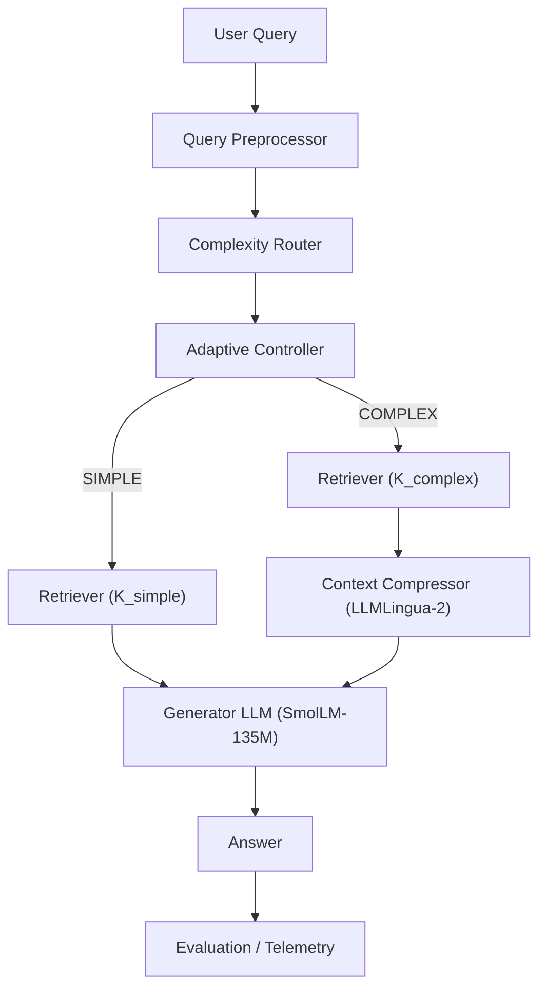

# AdaptiveRAG — Technical Architecture

> **Status:** Architecture v2.0 (revised to reflect implementation reality and reduced scope)
> **Derived From:** [`prod-spec.md`](file:///c:/Users/aniru/AdaptiveRAG/docs/prod-spec.md)
> **Project:** AdaptiveRAG — Adaptive Retrieval-Augmented Generation using Query Complexity and Context Optimization
> **Purpose:** Define HOW the system is technically organized so that the product specification can be implemented correctly

---

## 1. Purpose and Scope

This document is the architectural companion to `prod-spec.md`.

```text
prod-spec.md          →  WHAT and WHY
architecture.md       →  HOW the system is structured
src/                  →  actual implementation
```

**This document defines:**

- system decomposition into components and layers;
- responsibilities, inputs, outputs, and boundaries of every major component;
- end-to-end data flow for every execution path;
- how the four research baselines share infrastructure;
- interface contracts between components;
- failure handling;
- configuration, storage, and observability;
- repository module boundaries;
- testing architecture;
- resolved and open architectural decisions (ADRs).

**This document does NOT:**

- repeat the full product specification;
- contain implementation code;
- change any product requirement;
- claim any unmeasured performance result.

---

## 2. Architectural Overview

### 2.1 High-Level System Diagram



### 2.2 Core Behavioral Flow

The canonical execution path, as defined by the product specification:

```text
                  QUERY
                    |
                    v
             PREPROCESSOR
                    |
                    v
           COMPLEXITY ROUTER
                    |
                    v
          ADAPTIVE CONTROLLER
               /          \
              /            \
         SIMPLE           COMPLEX
            |                 |
            v                 v
       RETRIEVE K_s      RETRIEVE K_c
            |                 |
            |                 v
            |           CONTEXT COMPRESSOR
            |            (failure → fallback
            |             to original context)
            |                 |
            +--------+--------+
                     |
                     v
               GENERATOR LLM
                     |
                     v
                  ANSWER
                     |
                     v
          EVALUATION / LOGGING
```

This flow is architecturally invariant. All implementation must preserve it.

The architecture intentionally has no microservices, message queues, or external infrastructure. All component communication is in-process Python.

---

## 3. Architectural Layers

```text
┌─────────────────────────────────────────────┐
│  Input / Interface Layer                    │  CLI entry point; thin wrapper
├─────────────────────────────────────────────┤
│  Orchestration Layer                        │  Pipeline + Adaptive Controller
├─────────────────────────────────────────────┤
│  Intelligence Layer                         │  Complexity Router (classifier)
├─────────────────────────────────────────────┤
│  Retrieval & Context Layer                  │  Embeddings, ChromaDB, Retriever,
│                                             │  LLMLingua-2 Compressor
├─────────────────────────────────────────────┤
│  Generation Layer                           │  Fixed Generator LLM (SmolLM-135M)
├─────────────────────────────────────────────┤
│  Evaluation & Experiment Layer              │  Metrics, Benchmark Runner,
│                                             │  Structured Result Files
└─────────────────────────────────────────────┘
```

**Layer summary:**

| Layer | Responsibility | Research role |
|---|---|---|
| Input/Interface | Accept query; return answer + metadata | Entry point only; not a research contribution |
| Orchestration | Coordinate pipeline; enforce routing policy | Houses the adaptive decision logic |
| Intelligence | Estimate query complexity (SIMPLE/COMPLEX) | The learned routing component |
| Retrieval & Context | Retrieve chunks; optionally compress | Adaptive depth + selective compression happen here |
| Generation | Generate answer from query + context | Fixed; identical across all baselines |
| Evaluation & Experiment | Measure, compare, and record results | Scientific measurement layer |

---

## 4. System Components

### 4.1 Query Preprocessor

| Property | Value |
|---|---|
| **File** | `src/utils/preprocessor.py` |
| **Status** | ✅ Implemented |
| **Input** | Raw query string |
| **Output** | `PreprocessedQuery { normalized_query, original_query }` |
| **Deterministic** | Yes |

**Responsibilities:** Validate input (reject empty/malformed), normalize whitespace, preserve original query for logging.

**Must NOT:** Generate answers, retrieve documents, make routing decisions, rewrite query using an LLM.

---

### 4.2 Complexity Router

| Property | Value |
|---|---|
| **File** | `src/router/query_classifier.py` |
| **Status** | ✅ Implemented |
| **Input** | Normalized query string |
| **Output** | `ComplexityResult { label: SIMPLE\|COMPLEX, confidence: float, latency_ms: float }` |
| **Model** | `distilbert-base-uncased` (ADR-002, resolved) |
| **Deterministic** | Yes (given fixed weights and seed) |

**Architectural requirements:**
- Binary classification only (SIMPLE/COMPLEX). No multi-level routing in MVP.
- Must NOT use the generator LLM for routing decisions.
- Modular: the model can be replaced without redesigning the pipeline.
- Latency must be measured per inference call.
- On failure: apply configured fallback route (see §6.3).

**Model inference boundary:** Routing inference crosses from Python into neural-network forward pass. Latency measured independently.

---

### 4.3 Adaptive Routing Controller

| Property | Value |
|---|---|
| **File** | `src/router/routing_logic.py` |
| **Status** | ✅ Implemented |
| **Input** | `ComplexityResult` |
| **Output** | `RoutingDecision { complexity, retrieval_k, compression_enabled }` |
| **Deterministic** | Yes — pure policy mapping |

**Routing policy:**

| Complexity | retrieval_k | compression_enabled |
|---|---|---|
| SIMPLE | `K_simple` (config default: 2) | `false` |
| COMPLEX | `K_complex` (config default: 10) | `true` |

All values are configuration-driven. The controller is NOT an LLM-based agent.

---

### 4.4 Embedding Model

| Property | Value |
|---|---|
| **File** | `src/retriever/embeddings.py` |
| **Status** | ✅ Implemented |
| **Model** | `BAAI/bge-small-en-v1.5` (ADR-003, resolved) |

The same embedding model is used for both index construction (offline) and query-time retrieval. Identical across all primary baselines.

---

### 4.5 Vector Store / Index

| Property | Value |
|---|---|
| **Files** | `src/retriever/vector_store.py`, `data/index/` |
| **Status** | ✅ Implemented |
| **Technology** | ChromaDB (ADR-004, resolved) |
| **Persistent** | Yes — built once via `datasets/build_index.py`; reused across all baselines |

**Fairness constraint:** All primary baselines use the identical index. The index is never rebuilt between baselines.

---

### 4.6 Retriever

| Property | Value |
|---|---|
| **File** | `src/retriever/retriever.py` |
| **Status** | ✅ Implemented |
| **Input** | `query: string, top_k: int` |
| **Output** | `RankedDocuments [ { document_id, chunk_id, text, score, rank } ]` |
| **Deterministic** | Yes (given same index and query) |

**Fairness constraint:** The retrieval implementation is shared across all baselines. Only `top_k` changes between baselines.

The retriever does NOT decide whether to compress — that decision belongs to the routing controller.

---

### 4.7 Context Compressor

| Property | Value |
|---|---|
| **File** | `src/optimizer/context_optimizer.py` |
| **Status** | ✅ Implemented |
| **Model** | `microsoft/llmlingua-2-bert-base-multilingual-cased-meetingbank` (ADR-006, resolved) |
| **Input** | `query: string, retrieved_context: string` |
| **Output** | `OptimizedContext { text, original_tokens, compressed_tokens, compression_ratio, latency_ms, status }` |
| **Invocation** | Conditional — only when `RoutingDecision.compression_enabled == true` |

**Critical architectural boundary:** The compressor is not the research contribution. The contribution is *when* compression is invoked. The compressor is an established external tool.

```text
SIMPLE route  →  compressor NOT invoked
COMPLEX route →  compressor invoked
```

**Failure behavior:** If compression fails, preserve the original retrieved context, log `status=FAILED`, and continue pipeline. Do NOT crash.

**Model inference boundary:** LLMLingua-2 uses a BERT-based model internally. Compression latency must be measured independently.

---

### 4.8 Generator LLM

| Property | Value |
|---|---|
| **File** | `src/generator/response_generator.py` |
| **Status** | ✅ Implemented |
| **Model** | `HuggingFaceTB/SmolLM-135M-Instruct` (ADR-001, resolved) |
| **Input** | `query: string, context: string` |
| **Output** | `GeneratedAnswer { text, generation_latency_ms }` |
| **Frozen** | Yes — not fine-tuned; same model across all primary baselines |

**Prompt contract (fixed across all baselines):**

```text
Question:
    <user query>

Context:
    <retrieved or compressed context>
```

**Configuration-driven parameters:** `temperature`, `max_new_tokens`, `seed`.

**Model inference boundary:** The heaviest inference step. Dominates total latency.

> **Note on ADR-001 resolution:** The generator was selected as `SmolLM-135M-Instruct` (replaces the original Phi-3-mini direction) based on CPU/low-VRAM feasibility during M2.x implementation. This is the confirmed generator for all baselines.

---

### 4.9 Evaluation System

| Property | Value |
|---|---|
| **Files** | `src/evaluation/metrics.py`, `src/evaluation/benchmark.py`, `src/evaluation/latency.py` |
| **Status** | ✅ Implemented |
| **Input** | Predictions + references + execution metadata |
| **Output** | `EvaluationMetrics` |

**Answer quality metrics (required):**

| Metric | Notes |
|---|---|
| Exact Match (EM) | Binary; case-normalized |
| Token-level F1 | Token overlap |

**Retrieval quality (required where ground-truth document IDs are available):**

| Metric | Notes |
|---|---|
| Recall@K | Fraction of relevant documents retrieved |

MRR and nDCG are deferred — implement only if HotpotQA supporting-document IDs align with retrieved chunk IDs.

**Router quality metrics (required for Baseline D evaluation):**

| Metric |
|---|
| Accuracy |
| Precision (per-class) |
| Recall (per-class) |
| F1 (per-class + macro) |
| Confusion matrix (SIMPLE/COMPLEX) |

**Efficiency metrics (required for all baselines):**

| Metric |
|---|
| Router latency (ms) — Baseline D only |
| Retrieval latency (ms) |
| Compression latency (ms) — Baselines C, D only |
| Generation latency (ms) |
| Total latency (ms) |
| Retrieved context tokens |
| Compressed context tokens — Baselines C, D only |
| Final prompt tokens |
| Compression ratio — Baselines C, D only |
| Retrieval K |

**Optional metrics (not required for MVP completion):**
- Semantic similarity (BERTScore or similar)
- RAGAS-style faithfulness/relevance
- LLM-as-judge

---

### 4.10 Experiment Logger

| Property | Value |
|---|---|
| **Status** | ✅ Implemented |
| **Must NOT** | Alter pipeline behavior or research logic |

**Per-query metadata captured:**

```text
query_id
query
complexity_label
router_confidence
retrieval_k
compression_applied
original_context_tokens
compressed_context_tokens
compression_ratio
router_latency_ms
retrieval_latency_ms
compression_latency_ms
generation_latency_ms
total_latency_ms
error/fallback_status
```

**Per-experiment metadata captured:**

```text
experiment_id
timestamp
git_commit
config (copy of config.yaml)
hardware
model_identifiers
dataset
split
sample_count
```

---

## 5. Communication Paths

### 5.1 In-Process Communication

All component communication is in-process Python (function/method calls). No network protocols, message queues, or microservices.

```text
Query Interface → Preprocessor → Router → Controller
                                              |
                             +----------------+----------------+
                             |                                 |
                        (SIMPLE)                          (COMPLEX)
                             |                                 |
                        Retriever(K_s)              Retriever(K_c)
                             |                                 |
                             |                          Compressor
                             |                    (fallback to original on fail)
                             +-------------------+
                                                 |
                                           Generator
                                                 |
                                           Telemetry
```

### 5.2 Model Inference Boundaries

These are the points where the pipeline crosses from Python logic into neural-network inference:

| Boundary | Component | Model (current) |
|---|---|---|
| Routing inference | Complexity Router | distilbert-base-uncased (ADR-002, resolved) |
| Embedding inference | Embedding Model | BAAI/bge-small-en-v1.5 |
| Compression inference | Context Compressor | llmlingua-2-bert-base-multilingual-cased-meetingbank |
| Generation inference | Generator LLM | HuggingFaceTB/SmolLM-135M-Instruct |

Each boundary must have its latency measured independently.

### 5.3 Persistent Storage Boundaries

| Storage | Contents | When Built |
|---|---|---|
| `configs/config.yaml` | Experiment configuration | Static; updated per ADR resolution |
| `datasets/raw/` | Raw downloaded datasets | M1.1 |
| `datasets/corpus/chunks.jsonl` | Chunked documents | M1.3 |
| `data/index/` | ChromaDB vector index | M1.5 |
| `datasets/splits/` | Train/val/test + router splits | M1.2, M9.1 |
| `models/router/` | Trained router checkpoint | M9.2 |
| `results/<experiment>/` | Metrics, predictions, latency, config | Per benchmark run |

---

## 6. End-to-End Data Flow

### 6.1 SIMPLE Path

```text
User provides query string
    │
    ▼
Preprocessor
    │  validates, normalizes whitespace
    │  output: PreprocessedQuery { original, normalized }
    ▼
Complexity Router
    │  model inference on normalized query
    │  output: ComplexityResult { label: SIMPLE, confidence: 0.87, latency_ms: N }
    ▼
Adaptive Controller
    │  SIMPLE → K=2, compression=false
    │  output: RoutingDecision { complexity: SIMPLE, retrieval_k: 2, compression_enabled: false }
    ▼
Retriever
    │  embeds query, searches ChromaDB for top-2 chunks
    │  output: RankedDocuments [ chunk_1, chunk_2 ]
    ▼
Compression: SKIPPED
    │  raw retrieved context passed directly to generator
    ▼
Generator LLM (SmolLM-135M)
    │  receives: Question + raw Context
    │  output: GeneratedAnswer { text: "..." }
    ▼
Telemetry
    │  records: query, complexity=SIMPLE, K=2, compression=false,
    │           router_latency_ms, retrieval_latency_ms, generation_latency_ms, total_latency_ms
    ▼
Answer returned
```

### 6.2 COMPLEX Path

```text
User provides query string
    │
    ▼
Preprocessor
    │  output: PreprocessedQuery { original, normalized }
    ▼
Complexity Router
    │  output: ComplexityResult { label: COMPLEX, confidence: 0.91, latency_ms: N }
    ▼
Adaptive Controller
    │  COMPLEX → K=10, compression=true
    │  output: RoutingDecision { complexity: COMPLEX, retrieval_k: 10, compression_enabled: true }
    ▼
Retriever
    │  top-10 chunks from ChromaDB
    │  output: RankedDocuments [ chunk_1 ... chunk_10 ]
    ▼
Context Compressor (LLMLingua-2)
    │  compresses query + context at budget=0.5
    │  output: OptimizedContext { text: "...", original_tokens: N,
    │           compressed_tokens: M, ratio: N/M, latency_ms: P, status: SUCCESS }
    ▼
Generator LLM (SmolLM-135M)
    │  receives: Question + compressed Context
    │  output: GeneratedAnswer { text: "..." }
    ▼
Telemetry
    │  records: query, complexity=COMPLEX, K=10, compression=true,
    │           original_tokens, compressed_tokens, compression_ratio,
    │           all stage latencies
    ▼
Answer returned
```

### 6.3 Failure Paths

**Router failure:**
```text
Router raises exception or returns invalid output
    → Log failure; apply configured fallback route (default: SIMPLE)
    → Continue pipeline with fallback RoutingDecision
```

**Retrieval failure:**
```text
Retriever returns empty results or raises exception
    → Return structured retrieval failure; log
    → Do NOT fabricate evidence; pass empty context to generator or return error
```

**Compression failure:**
```text
Compressor raises exception
    → Preserve original retrieved context (do not crash)
    → Log: compression_status=FAILED, fallback=original_context
    → Continue to generator with uncompressed context
```

**Generator failure:**
```text
Generator raises exception or returns empty
    → Return structured generation failure
    → Mark example as failed in experiment results
    → Do NOT silently mark as successful
```

---

## 7. Baseline Architectures

All four baselines share the same underlying infrastructure. Only the pipeline policy changes.

### 7.1 Shared Infrastructure

The following are identical across all primary baselines:

- Document corpus (PopQA + HotpotQA supporting docs)
- Chunking (chunk_size=512, chunk_overlap=50 — configurable)
- Embedding model (`BAAI/bge-small-en-v1.5`)
- Vector index (ChromaDB, persisted in `data/index/`)
- Generator model (`HuggingFaceTB/SmolLM-135M-Instruct`)
- Prompt template (`Question:\n<q>\n\nContext:\n<c>`)
- Generation parameters (temperature, max_new_tokens, seed)
- Evaluation scripts
- Test query set

### 7.2 Baseline A — LLM Only

```text
Query → Preprocessor → Generator → Answer
```

- No retrieval. No compression. No routing.
- Purpose: measure the value of external retrieval.

### 7.3 Baseline B — Standard Fixed RAG

```text
Query → Preprocessor → Retriever(K=5) → Generator → Answer
```

- Fixed K=5 (configurable via `baseline_k`). No compression.
- Purpose: represent conventional fixed RAG.

### 7.4 Baseline C — Always-Compress RAG

```text
Query → Preprocessor → Retriever(K=10) → Compressor → Generator → Answer
```

- K=10 (configurable via `k_complex`). Compression always applied.
- Purpose: determine whether compression alone explains efficiency gains.

### 7.5 Baseline D — AdaptiveRAG (Proposed System)

```text
Query → Preprocessor → Router → Controller
    SIMPLE:  → Retriever(K=2)  →             Generator → Answer
    COMPLEX: → Retriever(K=10) → Compressor → Generator → Answer
```

- Adaptive K and selective compression based on estimated complexity.
- Purpose: evaluate the proposed adaptive strategy.

### 7.6 Baseline Comparison Matrix

| Property | LLM Only | Fixed RAG | Always-Compress | AdaptiveRAG |
|---|---|---|---|---|
| Retrieval | None | K=5 | K=10 | K=2 or K=10 |
| Compression | No | No | Always | Conditional |
| Router | No | No | No | Yes |
| Generator | SmolLM-135M | SmolLM-135M | SmolLM-135M | SmolLM-135M |
| Corpus/Index | — | Shared | Shared | Shared |
| Prompt | Same | Same | Same | Same |

---

## 8. Interface Contracts

Conceptual contracts. Exact Python types are implementation-defined.

### 8.1 Router Contract

```text
Input:
    query: string

Output:
    ComplexityResult:
        label: SIMPLE | COMPLEX
        confidence: float (optional)
        latency_ms: float
```

### 8.2 Controller Contract

```text
Input:
    ComplexityResult

Output:
    RoutingDecision:
        complexity: SIMPLE | COMPLEX
        retrieval_k: int
        compression_enabled: bool
```

### 8.3 Retriever Contract

```text
Input:
    query: string
    top_k: int

Output:
    RankedDocuments:
        list of:
            document_id: string
            chunk_id: string
            text: string
            score: float (optional)
            rank: int
```

### 8.4 Compressor Contract

```text
Input:
    query: string
    retrieved_context: string

Output:
    OptimizedContext:
        text: string
        original_tokens: int
        compressed_tokens: int
        compression_ratio: float
        latency_ms: float
        status: SUCCESS | FAILED
```

On failure: `status=FAILED`, `text=original retrieved_context` (fallback, not re-raised exception).

### 8.5 Generator Contract

```text
Input:
    query: string
    context: string

Output:
    GeneratedAnswer:
        text: string
        generation_latency_ms: float
```

### 8.6 Pipeline Contract

```text
Input:
    query: string

Output:
    PipelineResult:
        answer: string
        execution_metadata: ExecutionMetadata
```

### 8.7 ExecutionMetadata Contract

```text
ExecutionMetadata:
    query: string
    original_query: string
    complexity_label: SIMPLE | COMPLEX | None
    router_confidence: float | None
    retrieval_k: int
    retrieval_latency_ms: float | None
    compression_applied: bool
    original_context_tokens: int | None
    compressed_context_tokens: int | None
    compression_ratio: float | None
    compression_latency_ms: float | None
    generation_latency_ms: float
    total_latency_ms: float
    router_latency_ms: float | None
    error_status: string | None
```

Nullable fields are None for baselines that do not invoke the corresponding component.

---

## 9. Data and Storage Architecture

### 9.1 Persistent Storage

| Storage | Format | Purpose |
|---|---|---|
| `datasets/raw/` | JSONL | Raw normalized PopQA + HotpotQA |
| `datasets/corpus/chunks.jsonl` | JSONL | Fixed chunks (512 tokens, 50 overlap) |
| `data/index/` | ChromaDB directory | Persisted vector index |
| `datasets/splits/` | JSONL | Train/val/test + router_train/router_val splits |
| `models/router/` | Model checkpoint | Trained complexity classifier |
| `configs/config.yaml` | YAML | Default experiment configuration |
| `results/<experiment>/` | JSON/JSONL/CSV | Per-run metrics, predictions, latency |

### 9.2 Result Artifact Layout

```text
results/
└── <experiment_name>/
    ├── config.yaml          ← copy of run configuration
    ├── metrics.json         ← aggregate EM, F1, latency stats, token stats
    ├── predictions.jsonl    ← per-query: query, reference, prediction, all metadata
    ├── latency.csv          ← per-query latency breakdown
    └── routing.csv          ← per-query: complexity_label, retrieval_k, compression_applied
                               (Baseline D only)
```

---

## 10. Configuration Architecture

All experiment-sensitive parameters live in `configs/config.yaml`. No magic constants in source code.

### 10.1 Current Configuration Schema

```yaml
models:
  router:
    name: "distilbert-base-uncased"      # ADR-002: resolved
    checkpoint: null                      # path to fine-tuned checkpoint
  embeddings:
    name: "BAAI/bge-small-en-v1.5"       # ADR-003: resolved
  compressor:
    name: "microsoft/llmlingua-2-bert-base-multilingual-cased-meetingbank"  # ADR-006: resolved
  generator:
    name: "HuggingFaceTB/SmolLM-135M-Instruct"  # ADR-001: resolved

retrieval:
  k_simple: 2        # ADR-005: resolved
  k_complex: 10
  baseline_k: 5
  chunk_size: 512
  chunk_overlap: 50

routing:
  threshold: null
  fallback_route: "SIMPLE"

compression:
  enabled: true
  budget: 0.5        # ADR-006: initial default; validate at M12 ablation

generation:
  temperature: 0.1
  max_new_tokens: 256
  seed: 42

evaluation:
  dataset: "mixed"
  split: "test"
  sample_limit: 1000
  split_ratios: [0.7, 0.15, 0.15]

runtime:
  device: "auto"
  batch_size: 1
```

---

## 11. Failure Handling Architecture

| Component | Failure Mode | Expected Behavior |
|---|---|---|
| Preprocessor | Invalid/empty query | Reject with structured error; user must provide valid input |
| Router | Model inference failure | Log failure; apply fallback route (`routing.fallback_route`) |
| Router | Invalid output | Log; apply fallback route |
| Retriever | Empty results (0 chunks) | Return structured failure; log; continue with empty context or skip generation |
| Retriever | Index unavailable | Fail fast with structured error |
| Compressor | Compression failure | Preserve original context; log `status=FAILED`; continue |
| Generator | Inference failure | Return structured failure; mark example as failed in results |
| Configuration | Invalid config | Fail fast at startup with clear message |

---

## 12. Performance and Observability Architecture

### 12.1 Latency Decomposition

```text
Total Latency = Router Latency + Retrieval Latency + Compression Latency + Generation Latency + Overhead
```

Each stage is independently measurable. The architecture enables measurement — it does not claim any specific result.

### 12.2 Observability Points

| Stage | Metrics Captured |
|---|---|
| Router | `router_latency_ms`, `complexity_label`, `confidence` |
| Retriever | `retrieval_latency_ms`, `retrieval_k`, `num_chunks_returned` |
| Compressor | `compression_latency_ms`, `original_tokens`, `compressed_tokens`, `compression_ratio`, `status` |
| Generator | `generation_latency_ms`, output text |
| Pipeline | `total_latency_ms`, `error_status`, `fallback_status` |
| Evaluator | EM, F1, Recall@K, router metrics |

### 12.3 Infrastructure

Structured logging (`src/utils/logger.py`) and machine-readable result files are sufficient. No Prometheus, Grafana, or external monitoring infrastructure is required or planned.

---

## 13. Experimental Architecture

### 13.1 Controlled Comparison Design

```text
         Shared Dataset (PopQA + HotpotQA)
                        |
              Shared Corpus + Chunking
                        |
            Shared Vector Index (ChromaDB)
                        |
      +----------+------+------+----------+
      |          |             |          |
  LLM Only   Fixed RAG   Always-Compress  AdaptiveRAG
      |          |             |          |
      +----------+------+------+----------+
                        |
              Shared Generator (SmolLM-135M)
                        |
              Shared Evaluator (metrics.py)
                        |
              Comparable Results
```

### 13.2 Research Fairness Boundary

The following must remain identical across all primary baselines:

- Document corpus and chunking parameters
- Embedding model
- Vector index
- Retrieval implementation
- Generator model, prompt template, and generation parameters
- Evaluation scripts
- Hardware/environment (where possible)
- Test query set

Only the intended pipeline policy (retrieval K, compression, routing) changes.

### 13.3 Ablation Support

The architecture supports ablation by reconfiguring the pipeline:

| Ablation | Configuration Change | Priority |
|---|---|---|
| **A: Compression value** | K=10 + no compression vs K=10 + compression | **Required** |
| **B: Adaptive K value** | Fixed K vs complexity-dependent K (no compression) | Optional |
| **C: Router strategy** | Learned router vs heuristic router | Deferred |

---

## 14. Repository / Module Boundaries

### 14.1 Current Module Structure

```text
adaptive-rag-query-aware-retrieval/
│
├── README.md
├── docs/
│   ├── prod-spec.md
│   ├── architecture.md
│   └── development-plan.md
│
├── configs/
│   └── config.yaml                       ← Default experiment configuration
│
├── datasets/
│   ├── load_dataset.py                   ← Dataset download / normalization
│   ├── prepare_data.py                   ← Splitting + router label generation
│   ├── build_corpus.py                   ← Corpus chunking
│   ├── build_index.py                    ← Corpus → ChromaDB index
│   ├── fixtures_loader.py                ← Local dev fixture loader
│   ├── fixtures/                         ← Dev fixture queries
│   ├── raw/                              ← Downloaded datasets (git-ignored)
│   ├── corpus/                           ← Chunked documents
│   └── splits/                           ← Train/val/test JSONL splits
│
├── data/
│   └── index/                            ← ChromaDB persistent index
│
├── src/
│   ├── router/
│   │   ├── query_classifier.py           ← [M9] Router model wrapper
│   │   └── routing_logic.py              ← [M10] Controller / policy mapping
│   │
│   ├── retriever/
│   │   ├── embeddings.py                 ← ✅ Embedding model wrapper
│   │   ├── vector_store.py               ← ✅ ChromaDB interface
│   │   └── retriever.py                  ← ✅ Top-K retrieval interface
│   │
│   ├── optimizer/
│   │   └── context_optimizer.py          ← ✅ LLMLingua-2 compression wrapper
│   │
│   ├── generator/
│   │   └── response_generator.py         ← ✅ Generator LLM (SmolLM-135M)
│   │
│   ├── pipeline/
│   │   └── adaptive_rag.py               ← ✅ Pipeline (llm_only, fixed_rag)
│   │                                        [M8] always_compress mode
│   │                                        [M10] adaptive mode
│   │
│   ├── evaluation/
│   │   ├── metrics.py                    ← [M7] EM, F1, router metrics
│   │   ├── benchmark.py                  ← [M7] Benchmark runner
│   │   └── latency.py                    ← [M7] Latency measurement utilities
│   │
│   └── utils/
│       ├── config.py                     ← ✅ Configuration loading/validation
│       ├── logger.py                     ← ✅ Structured logging
│       └── preprocessor.py              ← ✅ Query preprocessing
│
├── scripts/
│   ├── run_pipeline.py                   ← ✅ CLI: run single query or batch
│   ├── evaluate.py                       ← [M7] Benchmark evaluation runner
│   ├── train_router.py                   ← [M9] Router fine-tuning
│   └── evaluate_router.py               ← [M9] Router classification metrics
│
├── tests/                                ← 73 passing tests (M6.1 baseline)
│   └── [existing + new tests per milestone]
│
├── notebooks/                            ← Analysis and visualization only (post-MVP)
├── results/                              ← Experiment output artifacts
├── models/
│   └── router/                           ← [M9] Trained checkpoint
│
├── requirements.txt
└── pyproject.toml
```

`✅` = implemented and committed. `[Mx]` = planned in that milestone.

---

## 15. Hardware / Software Boundary

### 15.1 Software Stack

| Layer | Technology |
|---|---|
| Language | Python 3.x |
| ML Framework | PyTorch + Hugging Face Transformers |
| Vector Store | ChromaDB |
| Compression | LLMLingua (llmlingua package) |
| Embeddings | Sentence-Transformers / direct model loading |
| Configuration | YAML (PyYAML) |
| Testing | pytest |
| Experiment tracking | Structured JSON/CSV files |

### 15.2 Hardware / Runtime

The system is designed for local execution on consumer hardware.

| Resource | Usage |
|---|---|
| CPU | Preprocessing, routing (small model), embedding, evaluation |
| GPU/VRAM | Router inference, embedding, compression, generation (if available) |
| RAM | Dataset loading, ChromaDB index, batch processing |
| Local storage | Vector index, model checkpoints, experiment results |

SmolLM-135M runs on CPU; LLMLingua-2 runs on CPU (verified M6.1). A GPU is not required, but reduces generation latency.

---

## 16. Testing Architecture

### 16.1 Unit Tests

| Test Target | What Is Tested |
|---|---|
| Preprocessor | Input validation, whitespace normalization, empty query rejection |
| Router output | ComplexityResult structure, label validity, confidence range |
| Controller | K selection logic (SIMPLE→K_simple, COMPLEX→K_complex), compression gating |
| Configuration | Config loading, validation, default values |
| Metrics | EM calculation, F1 calculation, compression ratio calculation |
| Latency measurement | Timing wrapper accuracy |

### 16.2 Integration Tests

| Test Target | What Is Tested |
|---|---|
| Router → Controller | ComplexityResult flows correctly into RoutingDecision |
| Retriever → Pipeline | Retrieved chunks flow into generator with correct metadata |
| Compressor → Pipeline | Compressed output integrates with generator input |
| Full pipeline (SIMPLE) | K=2, no compression, metadata populated |
| Full pipeline (COMPLEX) | K=10, compression applied, metadata populated |

### 16.3 Failure Tests

| Test Target | What Is Tested |
|---|---|
| Empty query | Preprocessor rejects gracefully |
| Router failure | Fallback route applied and logged |
| Compression failure | Original context preserved; pipeline continues |
| Generator failure | Structured error returned; example marked as failed |
| Invalid config | Fail-fast with clear error message |

### 16.4 Research Regression Tests

Core invariants that must not be broken by refactoring:

- `SIMPLE → K_simple → compression_enabled=false`
- `COMPLEX → K_complex → compression_enabled=true`
- All baselines use the same generator, corpus, embeddings, and prompt.

---

## 17. What Is Intentionally Not Architected

The following have no architecture in the MVP because they are explicitly out of scope per the product specification:

| Excluded | Reason |
|---|---|
| GraphRAG | Out of scope |
| Autonomous agents / multi-agent workflows | Out of scope |
| Web search retrieval | Out of scope |
| Multimodal retrieval | Out of scope |
| Dynamic semantic re-chunking | Out of scope (adds uncontrolled experimental variables) |
| Custom compression algorithms | Out of scope (using established LLMLingua-2) |
| Generator fine-tuning / RLHF | Out of scope |
| Hallucination detection subsystem | Out of scope |
| Prometheus / Grafana / external monitoring | Out of scope |
| REST API / microservices | Out of scope |
| Frontend / mobile application | Out of scope |
| Kubernetes / cloud-native deployment | Out of scope |
| Multi-level routing (EASY/MEDIUM/HARD) | Post-MVP extension only |
| Large-scale distributed serving | Out of scope |

---

## 18. Architectural Decisions (ADR Status)

| ADR | Decision | Status | Resolution |
|---|---|---|---|
| ADR-001 | Generator model | ✅ Resolved | `HuggingFaceTB/SmolLM-135M-Instruct` (CPU/low-VRAM feasibility) |
| ADR-002 | Router model | 🔲 Open | Direction: `microsoft/deberta-v3-small`; confirm at M9.1 |
| ADR-003 | Embedding model | ✅ Resolved | `BAAI/bge-small-en-v1.5` |
| ADR-004 | Vector store | ✅ Resolved | ChromaDB |
| ADR-005 | K values | 🔲 Open (defaults set) | K_simple=2, K_complex=10, K_baseline=5; validate at M9.3 |
| ADR-006 | Compression budget | ✅ Resolved (initial) | 0.5; validate at M12 ablation |
| ADR-007 | Router confidence threshold | 🔲 Open | Determine after M9.3 router evaluation; may not be needed |
| ADR-008 | External inference fallback | ✅ Not needed | Local SmolLM confirmed feasible on CPU |

---

## 19. Architectural Principles

1. **Keep the core pipeline simple.** Research value comes from the controlled experiment, not architectural complexity.
2. **Keep the router replaceable.** The classifier model is a pluggable component behind a stable interface.
3. **Keep the retriever and generator shared across baselines.** Essential for experimental fairness.
4. **Keep routing decisions explicit.** The controller is a deterministic policy mapping, not a hidden heuristic.
5. **Keep compression gating explicit.** SIMPLE→skip, COMPLEX→compress must be visible and testable.
6. **Keep experiment configuration externalized.** All experiment-sensitive parameters in config files, not source code.
7. **Keep measurements observable.** Every pipeline stage exposes latency and relevant metadata.
8. **Preserve reproducibility.** Configuration, model versions, dataset splits, seeds, and hardware recorded with every experiment.
9. **Avoid unnecessary services.** Modular Python application is sufficient.
10. **Do not expand scope without updating `prod-spec.md`.**

---

## 20. Document Maintenance

This document must be updated if:

- A major component is added or removed.
- An interface contract changes materially.
- A baseline architecture changes.
- An ADR is resolved (update §18 and the relevant component table in §4).
- The product specification changes in ways that affect system structure.

Minor implementation refinements do not require architecture document updates.
